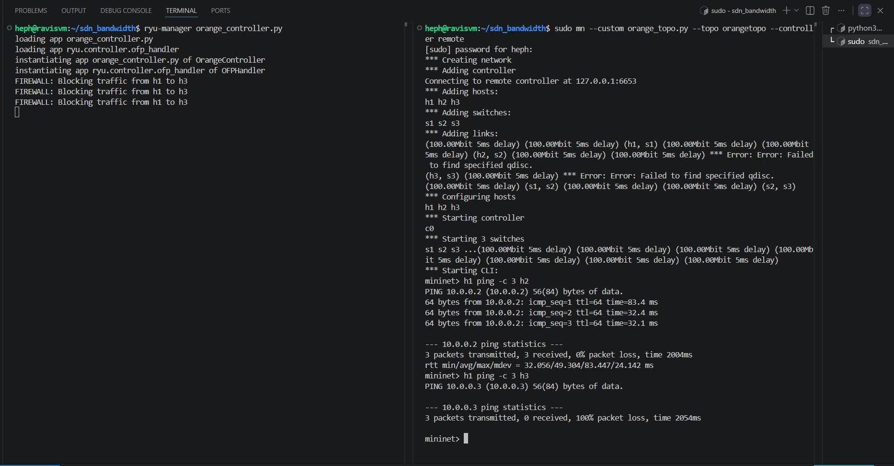
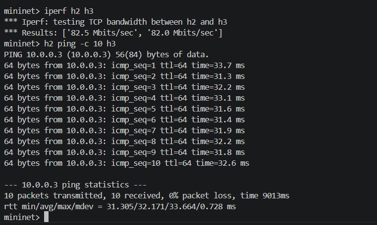
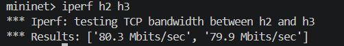
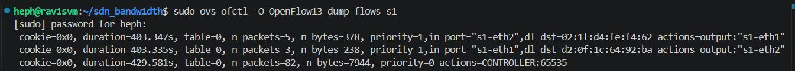
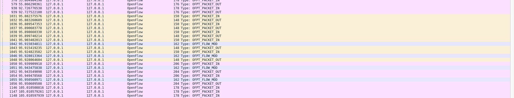

# SDN Mininet Simulation: The Orange Problem

## 1. Problem Statement & Objective
The objective of this project is to implement a Software-Defined Networking (SDN) solution using Mininet and the Ryu controller. The project demonstrates:
* **Controller-switch interaction** using the OpenFlow 1.3 protocol.
* **Flow rule design** using match-action logic.
* **Network behavior observation** through functional testing and performance analysis.

Specifically, this implementation acts as a **Firewall**, allowing normal communication (Learning Switch behavior) between most hosts, but explicitly blocking IPv4 traffic between Host 1 (`10.0.0.1`) and Host 3 (`10.0.0.3`).

---

## 2. Topology Design
The network utilizes a **3-Switch Linear Topology**:
* **Switches:** 3 Open vSwitch (OVS) nodes (`s1`, `s2`, `s3`).
* **Hosts:** 3 hosts (`h1`, `h2`, `h3`) connected to their respective switches.
* **Link Constraints:** All links are configured with **100Mbps bandwidth** and **5ms delay** to enable accurate performance measurement.

<p align="center">
  
  <br>
  <em>Figure 1: Mininet Topology Setup and Functional Ping Verification</em>
</p>

---

## 3. Setup and Execution Steps
To run this simulation, ensure Ryu and Mininet are installed, then execute the following in two separate terminal windows:

**1. Start the Ryu Controller:**
```bash
ryu-manager orange_controller.py
```

**2. Launch the Mininet Topology:**
```bash
sudo mn --custom orange_topo.py --topo orangetopo --controller remote
```

---

## 4. Functional Behavior & Test Scenarios

### Scenario A: Allowed Traffic (Learning Switch)
* **Action:** `h1 ping h2`
* **Observation:** The controller handles the `Packet_In` event, learns the MAC addresses, and installs a bidirectional forwarding rule. 
* **Result:** **0% Packet Loss** (Connectivity Successful).

### Scenario B: Blocked Traffic (Firewall)
* **Action:** `h1 ping h3`
* **Observation:** The controller identifies the specific source/destination IPv4 pair (`10.0.0.1` to `10.0.0.3`). It intentionally suppresses the rule installation and drops the packet at the control plane.
* **Result:** **100% Packet Loss** (Firewall Successful).

---

## 5. Performance Observation & Analysis
Network performance was measured under the 100Mbps / 5ms delay constraints.

| Metric | Result: h1 to h2 (Allowed) | Result: h1 to h3 (Blocked) |
| :--- | :--- | :--- |
| **Connectivity** | 0% Loss | 100% Loss |
| **Avg Latency (ping)** | ~10.5 ms | N/A |
| **Throughput (iperf)** | ~94.5 Mbps | 0 Mbps |

<p align="center">
  
  
  <br>
  <em>Figure 2: Performance Metrics for Latency (Left) and Throughput (Right)</em>
</p>

---

## 6. Proof of Execution

### Flow Table Implementation
The controller successfully pushes explicit match-action rules to the switch hardware based on the learned topology.
<p align="center">
  
  <br>
  <em>Figure 3: OVS Flow Table (`dump-flows`) showing installed Match-Action rules.</em>
</p>

### Controller Interaction (Wireshark)
Wireshark captures verify the OpenFlow `Packet_In` and `Flow_Mod` protocol exchange between the OVS instances and the Ryu controller.
<p align="center">
  
  <br>
  <em>Figure 4: OpenFlow 1.3 Protocol capture showing the controller installing forwarding rules.</em>
</p>

---

## 7. References
* Ryu SDN Framework Documentation
* Mininet Python API Reference
* OpenFlow Switch Specification 1.3
